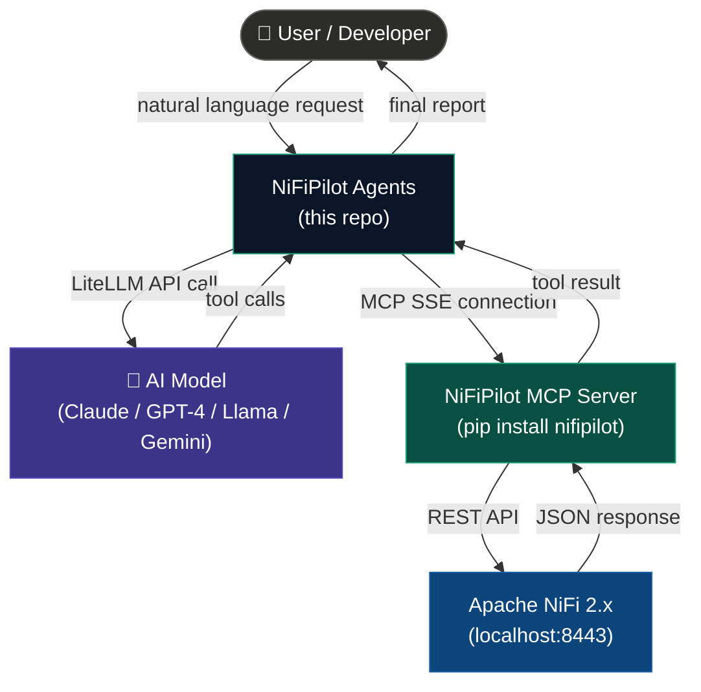
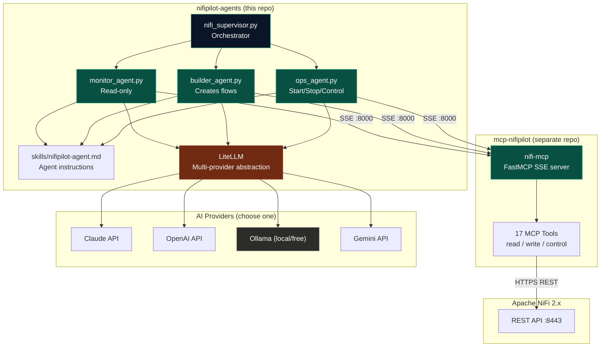
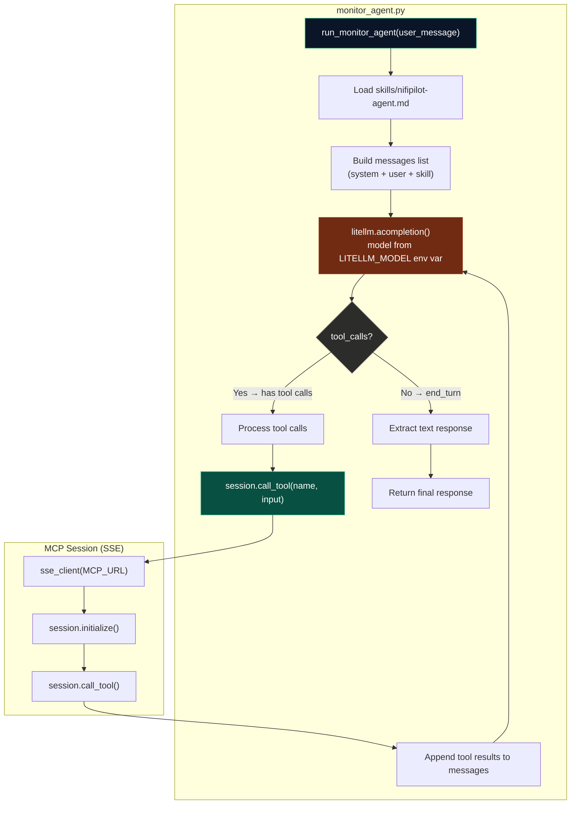

# Architecture — NiFiPilot Agents

## C1 — System Context

---

## C2 — Container Diagram

---

## C3 — Component Diagram (Monitor Agent internals)

---

## Design Decisions

### ADR-001 — LiteLLM over direct SDK

**Decision:** Use LiteLLM as the AI provider abstraction layer instead of calling Anthropic, OpenAI or other SDKs directly.

**Why:** NiFiPilot Agents should work with any AI model — Claude, GPT-4, Gemini, local Ollama models, DeepSeek, etc. LiteLLM provides a unified OpenAI-compatible interface for all providers with a single line change in `.env`.

**Trade-off:** LiteLLM adds one dependency and a thin abstraction layer. Accepted because provider flexibility outweighs this cost.

---

### ADR-002 — SSE connection per agent run

**Decision:** Open one SSE connection to the NiFiPilot MCP server per agent invocation and keep it open for the entire agentic loop.

**Why:** Opening and closing the SSE connection on every tool call would add significant latency. Keeping one session open for the duration of the loop is more efficient and matches how MCP clients like Claude Code work.

---

### ADR-003 — Skill-based instruction set

**Decision:** Agent behavior is defined in `skills/nifipilot-agent.md`, not hardcoded in the system prompt alone.

**Why:** The skill file can be updated, versioned and shared across agents without changing code. It also allows users to customize agent behavior by editing the markdown file. The system prompt contains the role definition; the skill contains the operational rules.

---

### ADR-004 — Specialized sub-agents over one monolithic agent

**Decision:** Separate agents for monitoring, building and operations instead of one agent that does everything.

**Why:** Specialized agents are easier to test, safer (monitor agent is read-only by design), and easier to reason about. The supervisor orchestrates them for complex tasks.

---

## Roadmap

- [x] Monitor Agent with LiteLLM + MCP SSE
- [ ] Builder Agent — create flows from natural language
- [ ] Ops Agent — start/stop/control operations  
- [ ] Supervisor Agent — orchestrate sub-agents
- [ ] Grafana MCP integration — query dashboards
- [ ] Loki MCP integration — search NiFi logs
- [ ] Observability Agent — correlate metrics with flow events
